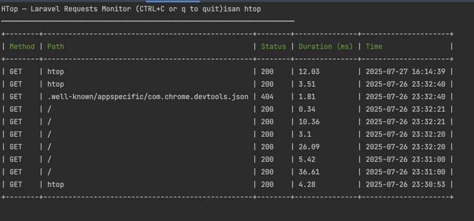

# htop (Laravel Package) [WIP]

> Real-time request monitor for Laravel — inspired by Linux `htop`.  
> Includes CLI mode and a WebSocket-powered dashboard using Laravel Reverb.


---

## ⚡️ Features

- CLI command: `php artisan htop`
- Realtime Web UI powered by Laravel Reverb (WebSockets)
- Auto-captures incoming request method, path, status, duration, time
- Configurable request filtering (e.g., exclude `/htop-data`)
- Lightweight, framework-native

---

## 📦 Installation

```bash
composer require khaledalam/htop --dev
php artisan vendor:publish --tag=htop
```

### CLI:

